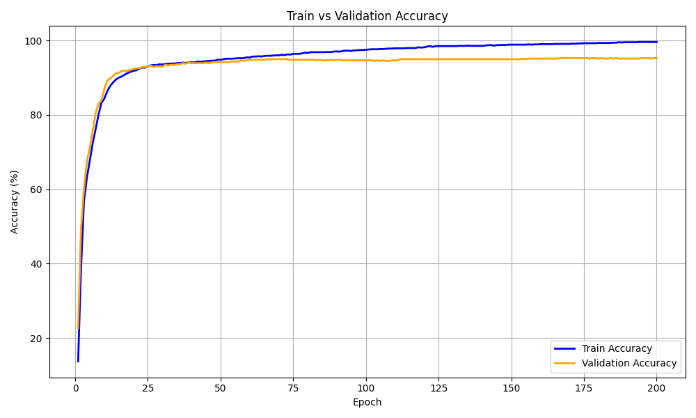
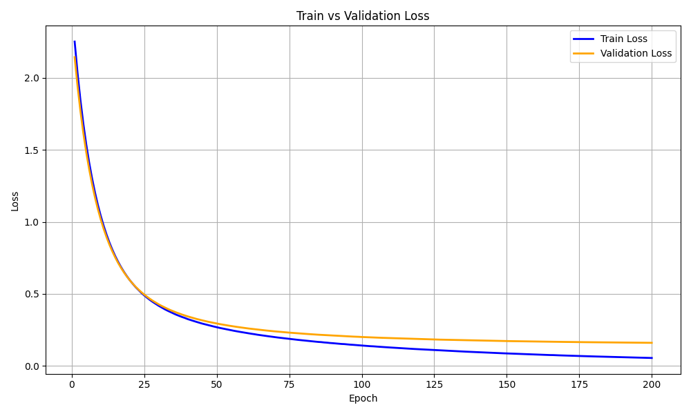
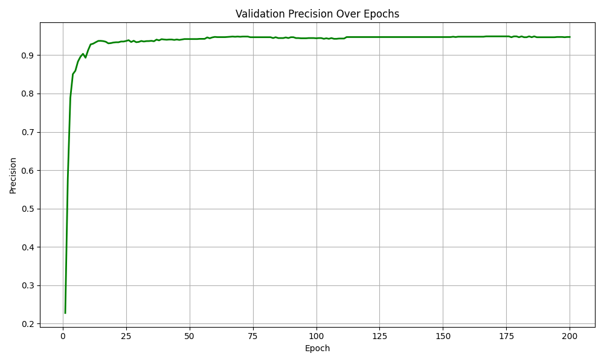
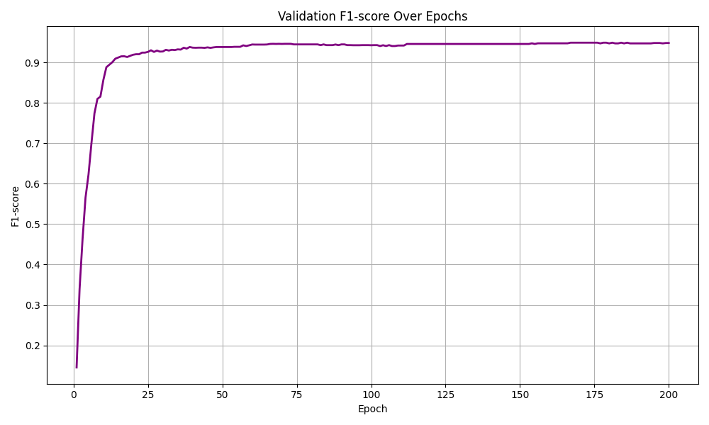

# About the project
EcomCLip (a.k.a E-commerce Clip model) is a project designed for the e-commerce domain. EcomCLip aims to enhance user experience by enabling fast and efficient prediction of product category trees - a task that was previously done manually, often resulting in incon-
venience and inefficiency. By fine-tuning the VisionTransformer ViT-B/32 architecture of the CLIP model, EcomCLip also paves the way for new approaches in applying image classification tasks in real-world scenarios.
* EcomCLip will utilize the MEPC-10 image dataset from e-commerce websites. For more details, please refer to the following link: [MEPC-dataset](https://huggingface.co/datasets/sherlockvn/MEPC)
* EcomClip uses the vision encoder and parameters of the CLIP model, specifically ViT-B/32, and then adds a classification layer for the classification task
## Result
### Accuracy

### Loss

### Precision

### Recall

### F1-SCore

## Installing
### Training on custom dataset guideline
First, make sure that the environment has all the libraries listed in our project fully installed.
```
pip install -r requirements.txt
```
Next, use the pull file to download the data for the project. Please change the `--url` path to the link of the dataset you want to use. Note that the file extension must be .zip (we will use the path [Mepc-10.zip](https://huggingface.co/datasets/sherlockvn/MEPC/resolve/main/MEPC10.zip?download=true) for training).

```
python utils/pull_dataset.py --url https://huggingface.co/datasets/sherlockvn/MEPC/resolve/main/MEPC10.zip?download=true
```
After a successful download, the data will be automatically unzipped. The final step is to run the `train.py` file to start the training process
```
python train.py
```
The evaluation results will be saved in the `visualizer` folder.
### Inference
To evaluate the results on the validation set, please run the following command:
```
python infer.py
```
The results will also be saved in the `visualizer` folder. To evaluate and visually test the results, please use the demo file.
```
python demo.py
```